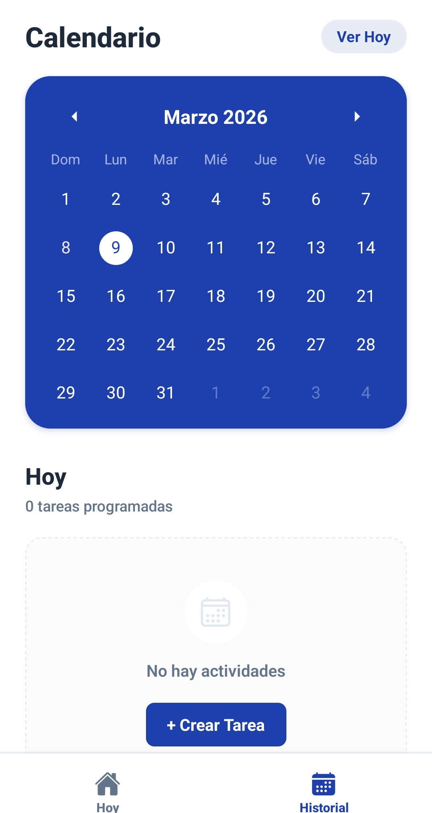
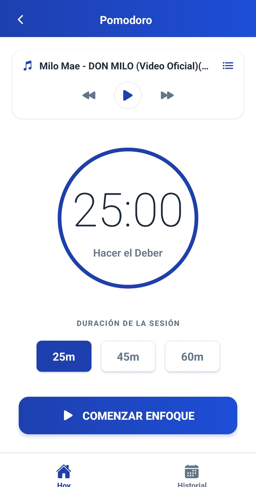
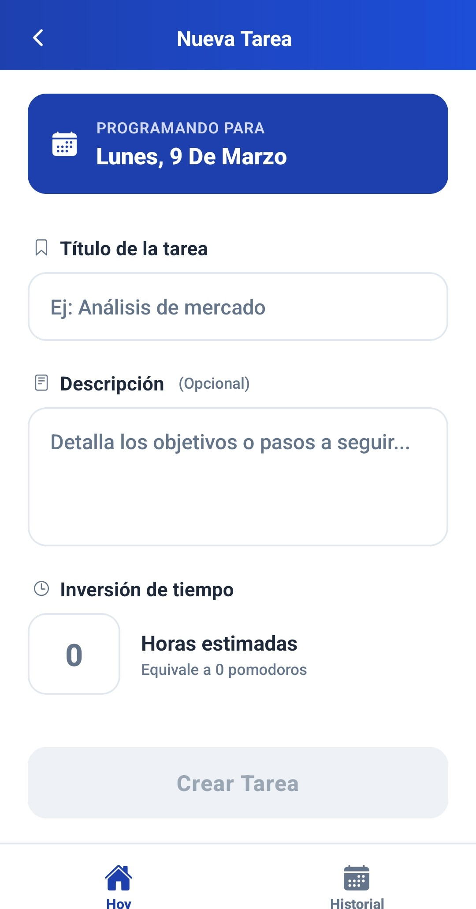

# Pomodoro Personal - Productivity Management System


---

## Resumen Ejecutivo

**Pomodoro Personal** es una solución móvil de alto rendimiento diseñada para la gestión del tiempo y la optimización de la productividad individual. Basada en la metodología Pomodoro, la aplicación permite a los usuarios finales planificar tareas, ejecutar ciclos de concentración y analizar el rendimiento mediante un sistema de persistencia local robusto.

---

## Especificaciones Técnicas

### Stack de Tecnologías

| Capa | Tecnología | Implementación |
| :--- | :--- | :--- |
| **Framework Principal** |  | Desarrollo Cross-Platform nativo. |
| **Ecosistema** |  | Gestión de ciclo de vida y SDK v54. |
| **Lenguaje** |  | Tipado estricto y arquitectura escalable. |
| **Base de Datos** |  | Almacenamiento relacional local (expo-sqlite). |
| **UI/UX** |  | Diseño modular y componentes interactivos. |

### Funcionalidades Core

*   **Motor de Temporización:** Sistema de control de ciclos Pomodoro con estados de ejecución asíncronos.
*   **Gestión de Tareas:** CRUD completo de objetivos diarios con seguimiento de tiempo acumulado versus objetivo.
*   **Módulo de Notas Contextuales:** Sistema de anotaciones vinculado a entidades de tareas mediante relaciones de llave foránea.
*   **Analítica de Sesiones:** Registro histórico de bloques de tiempo (sesiones) para auditoría de productividad.
*   **Sistema de Notificaciones:** Integración nativa para alertas de fin de ciclo y recordatorios de sistema.

---

## Módulos de Interfaz (Screens)

El sistema se compone de módulos de interfaz especializados para cada etapa del flujo de productividad:

<table width="100%">
  <tr>
    <td width="30%"></td>
    <td>
      <h3> Panel de Control Diario</h3>
      <p>Módulo principal que presenta un resumen ejecutivo del rendimiento diario. Incluye indicadores de tiempo de enfoque acumulado, conteo de tareas completadas y una lista priorizada de objetivos para la jornada actual.</p>
    </td>
  </tr>
  <tr>
    <td width="30%"></td>
    <td>
      <h3> Vista Cronológica</h3>
      <p>Módulo de navegación temporal que permite visualizar la distribución de carga de trabajo mediante un calendario interactivo. Sirve como punto de acceso para la auditoría de días previos.</p>
    </td>
  </tr>
  <tr>
    <td width="30%"></td>
    <td>
      <h3> Motor de Concentración</h3>
      <p>Interfaz de alta fidelidad dedicada a la ejecución de ciclos Pomodoro. Implementa controles de estado (Play/Pause/Reset) y visualización de progreso en tiempo real para la tarea activa.</p>
    </td>
  </tr>
  <tr>
    <td width="30%"></td>
    <td>
      <h3> Configuración de Tareas</h3>
      <p>Interfaz optimizada para el registro de nuevos objetivos, permitiendo definir nombres, descripciones técnicas y tiempos estimados de ejecución de forma ágil.</p>
    </td>
  </tr>
  <tr>
    <td width="30%"><i>Imagen pendiente</i></td>
    <td>
      <h3> Gestión de Tarea y Notas</h3>
      <p>Vista detallada que permite la administración de metadatos de una tarea específica. Facilita la creación y categorización de notas contextuales (Importante, Idea, Conclusión) vinculadas directamente al historial de trabajo.</p>
    </td>
  </tr>
</table>

---

## Arquitectura de Software

La aplicación sigue un patrón de diseño modular centrado en la separación de responsabilidades:

```text
src/
├── components/    # Unidades de interfaz de usuario atómicas y reutilizables.
├── database/      # Capa de abstracción de datos (DAL) y esquemas relacionales.
├── hooks/         # Lógica de negocio encapsulada y controladores de estado.
├── screens/       # Componentes de alto nivel (vistas de navegación).
├── styles/        # Definiciones globales de temas y tokens de diseño.
└── types/         # Definiciones de tipos estáticos e interfaces de dominio.
```

---

## Instalación y Despliegue

### Requisitos Previos

*   Node.js (versión LTS recomendada).
*   Gestor de paquetes npm o yarn.
*   Expo Go instalado en el dispositivo de pruebas o un emulador configurado.

### Procedimiento de Configuración

1.  **Clonación del Repositorio:**
    ```bash
    git clone <repository-url>
    cd Pomodoro-Personal
    ```

2.  **Instalación de Dependencias:**
    ```bash
    npm install
    ```

3.  **Ejecución del Entorno de Desarrollo:**
    ```bash
    npx expo start
    ```

---

## Consideraciones de Seguridad y Datos

*   **Persistencia:** Todos los datos se almacenan localmente en el dispositivo mediante SQLite, garantizando la privacidad del usuario.
*   **Integridad:** Se utilizan llaves foráneas y borrado en cascada para mantener la integridad referencial entre tareas y notas.

---
*Desarrollado bajo estándares de ingeniería de software para maximizar la eficiencia personal.*
